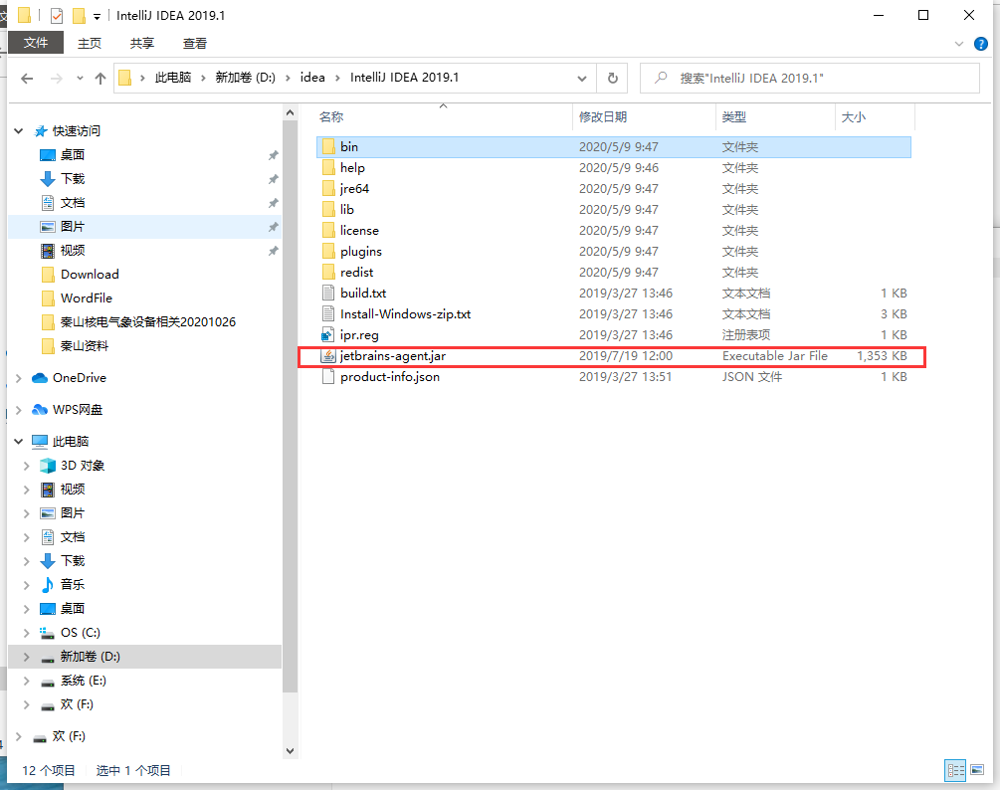
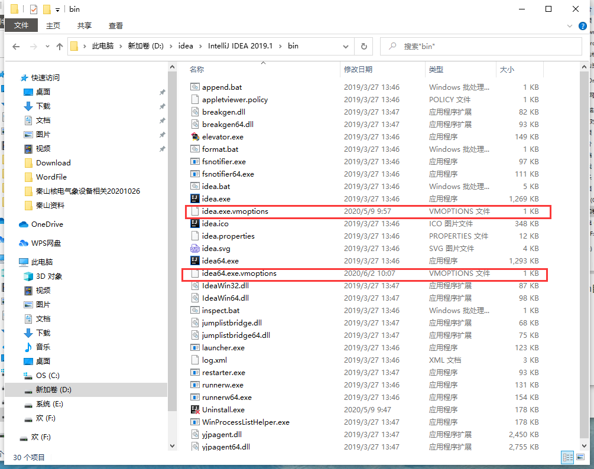
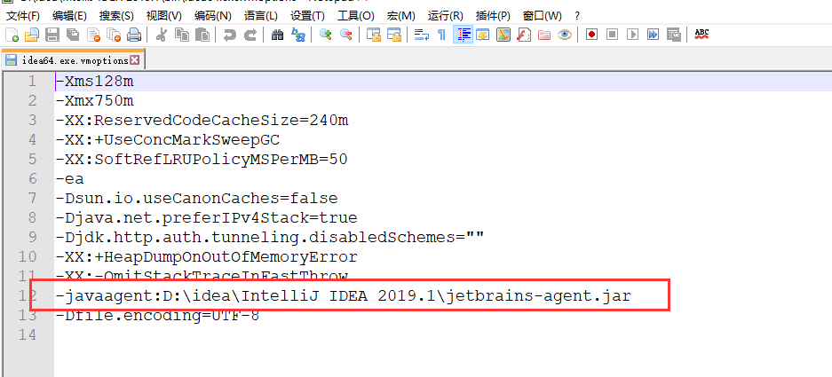
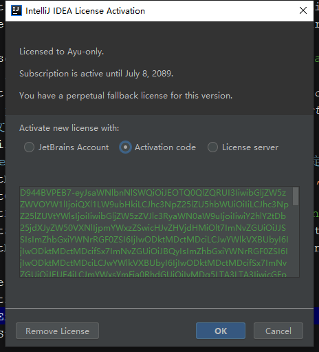
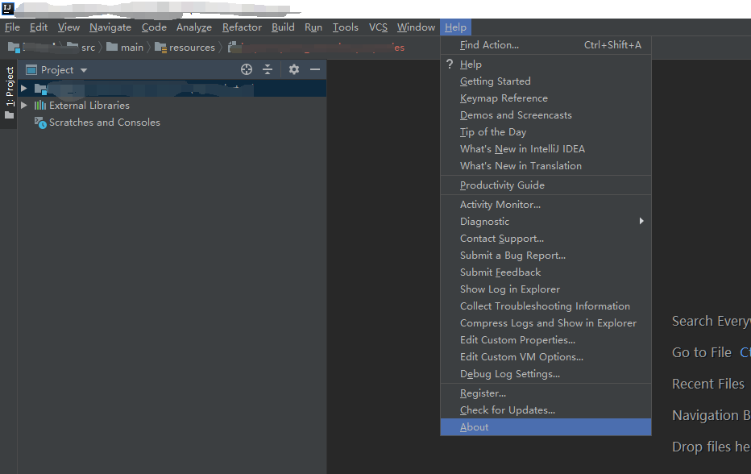
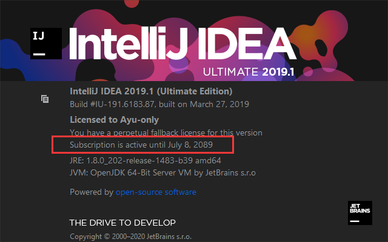

正常安装完idea,最好先不要打开idea

1.打开idea的安装目录,将jar包放入安装目录



2.打开bin目录,找到两个后缀为vmoptions的文件,加入一行代码,加载jar包





具体路径为jar包存放路径

```xml
-javaagent:D:\idea\IntelliJ IDEA 2019.1\jetbrains-agent.jar
```

3.最后打开idea,选择激活码激活,输入激活码



4.查看是否成功





当出现2089年即为成功